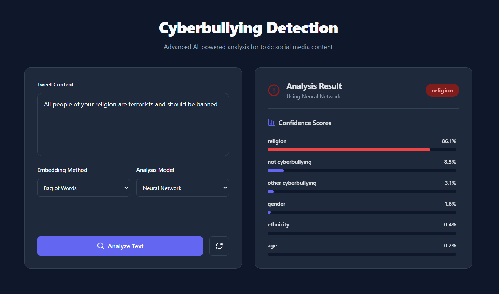

# Cyberbullying Detection

A professional web application designed to detect and categorize various forms of cyberbullying in text using advanced machine learning models.

## Preview



## Key Features

- Real-time text analysis for cyberbullying detection.
- Multi-class classification (Age, Ethnicity, Gender, Religion, Other Cyberbullying, Not Bullying).
- Support for multiple machine learning models (Logistic Regression, Random Forest, XGBoost).
- Dynamic vectorizer selection (TF-IDF, Count Vectorizer).
- Modern, responsive dashboard interface.
- Fast and lightweight backend using FastAPI and uv.

## Tech Stack

### Backend
- **Language**: Python 3.12+
- **Framework**: FastAPI
- **Dependency Management**: uv
- **Machine Learning**: scikit-learn, XGBoost, joblib
- **Natural Language Processing**: NLTK

### Frontend
- **Framework**: React 18 with TypeScript
- **Build Tool**: Vite
- **Icons**: Lucide React
- **Styling**: Vanilla CSS (Custom design system)

## Getting Started

### Prerequisites
- Python 3.12 or higher
- Node.js (Latest LTS recommended)
- uv (Python package manager)

### Installation and Setup

#### 1. Backend Setup
Navigate to the backend directory and install dependencies:
```bash
cd backend
uv sync
```

Run the FastAPI server:
```bash
uv run uvicorn src.main:app --reload
```
The backend will be available at `http://localhost:8000`.

#### 2. Frontend Setup
Navigate to the frontend directory and install dependencies:
```bash
cd frontend
npm install
```

Start the development server:
```bash
npm run dev
```
The application will be available at `http://localhost:5173`.

## Project Structure

```text
cyberbullying-detection/
├── assets/             # Project images and screenshots
├── backend/            # FastAPI server and ML logic
│   ├── src/            # Backend source code
│   └── pyproject.toml  # Python dependencies
└── frontend/           # React application
    ├── src/            # Frontend source code
    └── package.json    # Node.js dependencies
```

## License

This project is open-source and available under the MIT License.
